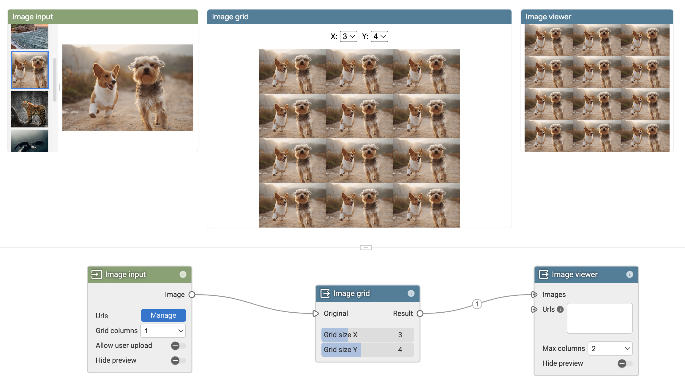

# Image grid

This custom node takes an input image and renders it into a grid. The grid size
can be set using number editors in the node, or from dropdowns in the preview
panel UI.

It shows how to render and update preview panel UI, how images are handled in
Visual Blocks, and how to manually trigger pipeline re-run from the preview
panel UI.



(You can also try connecting a camera input node to this node for some fun)

To build:

```bash
$ npm i
$ npm run build
```
