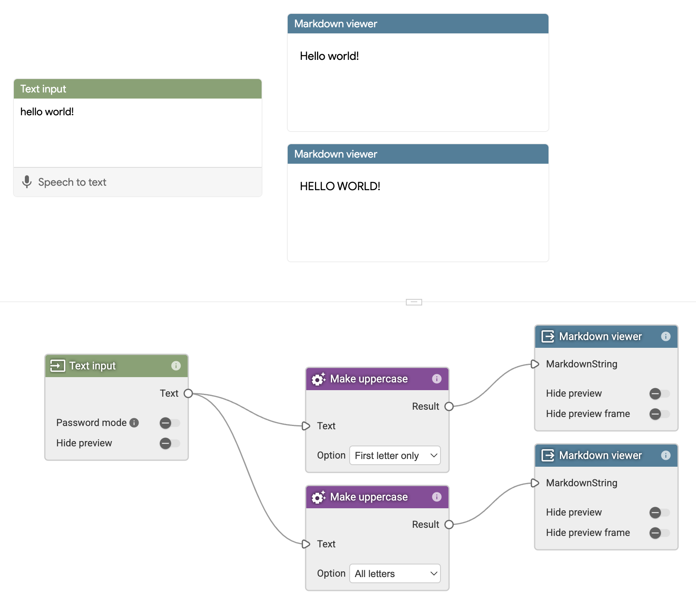

# Make uppercase

This example custom node takes a text input and transforms its first letter or
all the letters to upper case. It shows the basics of how a custom node works
in Visual Blocks.



To build:

```bash
$ npm i
$ npm run build
```
