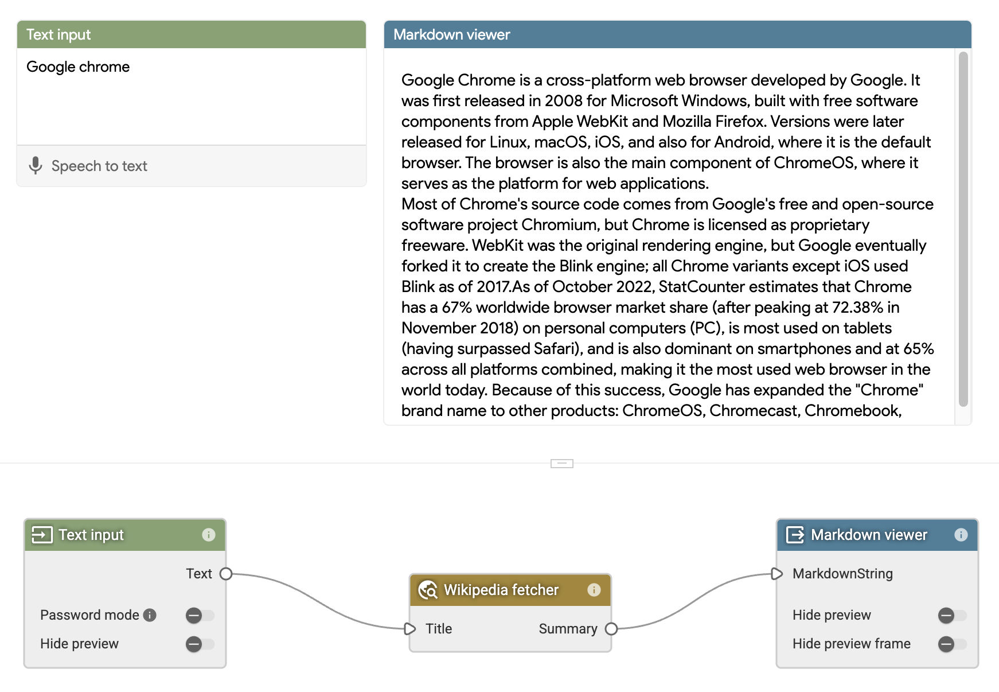

# Wikipedia summary fetcher

This example custom node fetches the summary of a wikipedia page by the given
title using a wikipedia API.

It shows how to use remote API call in a custom node, how to do simple inputs
de-dup and result caching, and how to surface errors. It also shows how to
develop custom nodes using Typescript and our custom node types package.



To build:

```bash
$ npm i
$ npm run build
```
