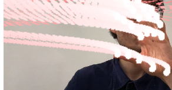
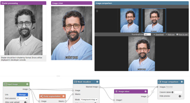
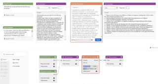
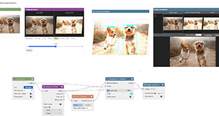

# Creator Guide for Visual Blocks

Thank you creators for contributing to Visual Blocks for ML! We firmly believe
that: with your contribution, we can inspire more hackers, designers, and
practitioners to unleash their creativity!

## Contributing a New Pipeline

### Step 1: CLA

Fork this repository and clone the forked repo to your laptop or workstation.
Review and sign the
[Contributor License Agreement](https://cla.developers.google.com/about) (CLA).
Now you are ready to create a pull request :)

### Step 2: Creating Your Pipeline

Visit https://visualblocks.withgoogle.com, click the `Demo` button. Next, click
the `Demo: Create Your Own` tab and start dragging and dropping nodes from the
node gallery and make your own pipelines. After you complete, come up with a
descriptive title, and click the `Export` button on the top right corner to
download. You may also click the `Import` button to load an existing pipeline.

### Step 3: Exporting the Pipeline

Copy the exported pipeline to your local repository, commit and create a
pull request by following
[the official GitHub guide](https://docs.github.com/en/pull-requests/collaborating-with-pull-requests/proposing-changes-to-your-work-with-pull-requests/creating-a-pull-request).
Make sure to add your pipeline to the corresponding subfolder within the
pipeline folder (i.e. audio, vision, multi-modal, etc.). We strongly recommend
contributors to also upload a GIF or JPG screenshot for your pipeline (width:
320px) to be featured in this guide.

### Step 4: Describing Your Pipeline (Optional)

Write a `.txt` file that describes your pipeline. The description should be as
**clear and concise** as possible. We encourage contributors to follow the two guidelines below:

* D1: The description should **explicitly** explain **what** the
pipeline does.
* D2: The description should NOT explain **how** the pipeline does
it.

For instance, for the
[weather summarizer](https://visualblocks.withgoogle.com/#/edit/_?project_json=https:%2F%2Fraw.githubusercontent.com%2Fgoogle%2Fvisualblocks%2Fmain%2Fpipelines%2Fllm%2Fpalm2_weather_summarizer.json)
pipeline:

&#9745; "Summarize the weather in San Francisco into in one sentence." - a good example

&#9746; "Weather summarizer" - a description that is too general and ambiguous [violating P1]

&#9746; "Get the weather in San Francisco first, and then use PaLM to summarize
the generated content into one sentence." - a description that includes too many unnecessary technical details [violating P2]

### Step 5: Naming your files

Please name your files in the following way:
- `.txt` files should have the same name as the `.json` file. Example: `pipeline_name.json` can have a txt file with the name `pipeline_name.txt`. 
- Image files should either have the same name as the `.json` file, or have the same name with `_highres` appended to the end. Example: `pipeline_name.json` can have image files with the names `pipeline_name.[image format]` or `pipeline_name_highres.[image format]`.

### Step 6: Uploading

After you have uploaded your pipeline to the `pipelines` folder, you can easily
share your amazing creation via URL like:
https://visualblocks.withgoogle.com/#/edit/_?project_json=https:%2F%2Fraw.githubusercontent.com%2Fgoogle%2Fvisualblocks%2Fmain%2Fpipelines%2Fgraphics%2F3dphoto_portrait_depth.json

### Step 7: Reviews
Submissions will be reviewed by repo managers to ensure compliance with [Google’s Generative AI Prohibited Use Policy](https://policies.google.com/terms/generative-ai/use-policy?hl=en-US). Please do not submit any pipelines that contain sensitive or personal information.

## Example Pipelines

Please refer to `graphics/3dphoto_portrait_depth.json` and
`llm/palm2_weather_summarizer.json` for two example pipelines and refer to the gallery below for interactive demos. Note that API keys
and locally uploaded images are not exported for privacy and security.

Before you get started on the PaLM example, you need to obtain an API key first.
Head to makersuite.google.com, sign up with your Google account, and click "Get
an API key". Once you have the key, you can start using the API.

## Visual Blocks Gallery

We highlight a set of community-contributed pipelines of Visual Blocks below:

### Interactive Graphics

*   [3D Photo](https://visualblocks.withgoogle.com/#/edit/_?project_json=https:%2F%2Fraw.githubusercontent.com%2Fgoogle%2Fvisualblocks%2Fmain%2Fpipelines%2Fgraphics%2F3dphoto_portrait_depth.json)
    with
    [Portrait Depth API](https://blog.tensorflow.org/2022/05/portrait-depth-api-turning-single-image.html?linkId=8063793)

    

*   [AR Sticker Effect](https://visualblocks.withgoogle.com/#/edit/_?project_json=https:%2F%2Fraw.githubusercontent.com%2Fgoogle%2Fvisualblocks%2Fmain%2Fpipelines%2Fwebcam%2Far_sticker_effect.json)
    with
    [Mediapipe Face Landmark Detection](https://developers.google.com/mediapipe/solutions/vision/face_landmarker)

    

*   [Laser Hands](https://visualblocks.withgoogle.com/#/edit/_?project_json=https:%2F%2Fraw.githubusercontent.com%2Fgoogle%2Fvisualblocks%2Fmain%2Fpipelines%2Fwebcam%2Flaser_hands_rough.json)
    with
    [Mediapipe Hand Landmark Detection](https://developers.google.com/mediapipe/solutions/vision/hand_landmarker)

    

*   [ColorPop](https://visualblocks.withgoogle.com/#/edit/_?project_json=https:%2F%2Fraw.githubusercontent.com%2Fgoogle%2Fvisualblocks%2Fmain%2Fpipelines%2Fgraphics%2Fcolorpop.json) with
    [Mediapipe Body Segmentation](https://blog.tensorflow.org/2022/01/body-segmentation.html)

    

### Natural Language Understanding

*   [Weather Summarizer](https://visualblocks.withgoogle.com/#/edit/_?project_json=https:%2F%2Fraw.githubusercontent.com%2Fgoogle%2Fvisualblocks%2Fmain%2Fpipelines%2Fllm%2Fpalm2_weather_summarizer.json)
    with [PaLM API](https://developers.generativeai.google)

    

*   [LaTeX Manuscript Helper](https://visualblocks.withgoogle.com/#/edit/_?project_json=https:%2F%2Fraw.githubusercontent.com%2Fgoogle%2Fvisualblocks%2Fmain%2Fpipelines%2Fllm%2Fpalm2_manuscript_helper.json)
    with [PaLM API](https://developers.generativeai.google)

    

*   [Werewolf Game](https://visualblocks.withgoogle.com/#/edit/_?project_json=https:%2F%2Fraw.githubusercontent.com%2Fgoogle%2Fvisualblocks%2Fmain%2Fpipelines%2Fllm%2Fpalm2_werewolf.json)
    with [PaLM API](https://developers.generativeai.google)

    

*   [Review Generation and Rating](https://visualblocks.withgoogle.com/#/edit/_?project_json=https:%2F%2Fraw.githubusercontent.com%2Fgoogle%2Fvisualblocks%2Fmain%2Fpipelines%2Fllm%2Freview_generation_and_rating.json)
    with GPT3.5

    

*   [Email tones explorer](https://visualblocks.withgoogle.com/#/edit/_?project_json=https:%2F%2Fraw.githubusercontent.com%2Fgoogle%2Fvisualblocks%2Fmain%2Fpipelines%2Fllm%2Fpalm2_email_tones_explorer.json)
    with [PaLM API](https://developers.generativeai.google)

    

*   [Email genereation review](https://visualblocks.withgoogle.com/#/edit/_?project_json=https:%2F%2Fraw.githubusercontent.com%2Fgoogle%2Fvisualblocks%2Fmain%2Fpipelines%2Fllm%2Fpalm2_email_generation_review.json)
    with [PaLM API](https://developers.generativeai.google)

    

*   [Title Generator](https://visualblocks.withgoogle.com/#/edit/_?project_json=https:%2F%2Fraw.githubusercontent.com%2Fgoogle%2Fvisualblocks%2Fmain%2Fpipelines%2Fllm%2Fpalm2_title_generator.json)
    with [PaLM API](https://developers.generativeai.google)

    

### Image Processing

*   [Low Light Enhancement](https://visualblocks.withgoogle.com/#/edit/_?project_json=https:%2F%2Fraw.githubusercontent.com%2Fgoogle%2Fvisualblocks%2Fmain%2Fpipelines%2Fvision%2Flow_light_enhancement.json)

    

*   [CartoonGAN](https://visualblocks.withgoogle.com/#/edit/_?project_json=https:%2F%2Fraw.githubusercontent.com%2Fgoogle%2Fvisualblocks%2Fmain%2Fpipelines%2Fgraphics%2Fcartoongan.json)

    

*   [Object Detection](https://visualblocks.withgoogle.com/#/edit/_?project_json=https:%2F%2Fraw.githubusercontent.com%2Fgoogle%2Fvisualblocks%2Fmain%2Fpipelines%2Fvision%2Fobject_detection.json)

    

## Community Guidelines

This project follows
[Google's Open Source Community Guidelines](https://opensource.google/conduct/).
